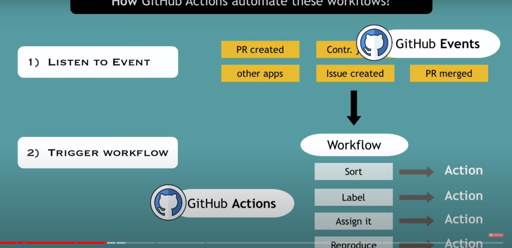
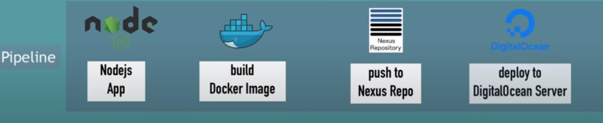

# GITHUB ACTIONS

> platform to automate developer workflows.

> _CI/CD tool_ is one of many workflows.

## github

    - platform for open source projects.
    - this projects r publically available to use and contribute to the project.
        - can add new contributors to the project.
        - creats many pull requests.

## organizational tasks

- for example, you created a library to work with date and time in java.
- u have some contributors and users for that library,
- whenever user witness a bug/issue in the library, he can create an _New Issue_ for the same.
- so developer checks whether it is a _minor/major_ issue. developer can also assign the issue to one of the contributors.
- if a contributor fixes the issue, he creates a pull request from the library and pushes the fixed code to the library. thus developer can merge that changes to master branch. then it is ready for the next release.

- so bigger the project gets, more contributors, mroe users for our projects, more new issues, more pull requests.
- in such case, it is better to automate the task as much as possible. for that purpose the _github action_ was created.

## how github actions automate these workflows?.

- When something happens in/to our repository. We can configure automatic actions to get executed in response.
- here the things that happen in repo r called _github events_. for example, **creating pull request, adding contibutors, creating issues, merging branches.**
- so two basic steps to automate workflows.

  1. listening to github events.
  2. trigger workflow depending on the event happened.

for example, if an **Issue Created** which is an event. developer do actions sucha as

    > sort the issue,
    > label it,
    > assign it to the contributors,
    > reproduce the issue.

combination of these actions makes up a _workflow_.



this explains the basic concept of github actions.

---

## CI/CD with github actions

- why use CI/CD tool?

1. if v already hosts code to github, we can use same tool for CI/CD pipeline as well.
2. set up process for CI/CD pipeline is easy.

## Advantage of CI/CD pipeline in github actions

- Integration with other technolgies is important.



- so here v use combination of diff tools in the development process.

- so by using _ci/cd pipeline_, we dont have to install
  all these tools and do configurations for each in our machine.

- Instead, we ask for an environment with all these tools and configurations already available.

---

### Build a workflow for our java gradle application

- first navigate to **Actions** in remote repository.
- choose **Java With Gradle** option.
- Opens a _gradle.yml_ file which is the _workflow file_.

#### Syntax of Workflow file

```yaml
# This workflow will build a Java project with Gradle
# For more information see: https://help.github.com/actions/language-and-framework-guides/building-and-testing-java-with-gradle

name: Java CI with Gradle

on:
  push:
    branches: [master]
  pull_request:
    branches: [master]

jobs:
  build:
    runs-on: ubuntu-latest

    steps:
      - uses: actions/checkout@v2
      - name: Set up JDK 1.8
        uses: actions/setup-java@v1
        with:
          java-version: 1.8
      - name: Grant execute permission for gradlew
        run: chmod +x gradlew
      - name: Build with Gradle
        run: ./gradlew build
```

- **name**: name of workflow which is optional.
- **on**: contains events that triggers the workflow, eg: push, pull request
- **jobs**: actiosn to be executed when an event happens.

  - **steps**: run commands, set up tasks or run an action.
  - **uses** - selects an _action_. here _checkout_ is the action to be executed. _v2_ is its version.
    eg: _actions/checkout@v2_ . actions are available in the _uses attribute_

  (Checkout Action yaml file)[https://github.com/actions/checkout/blob/main/action.yml]

  - **uses: actions/setup-java@v1
    with:
    java-version: 1.8**

    > another action to setup java with version 1.8. thus v dont have to install/configure java in our machines.

  - **run** : attribute to run a linux command.
    Eg:
    1. **run: chmod +x gradlew** - change permission of gradle file.
    2. **run: ./gradlew build** - build gradle

> all these things are done in same environment.

time: 18: 45

---
